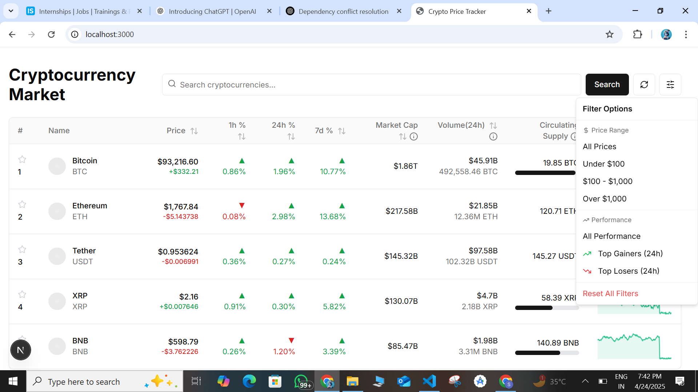
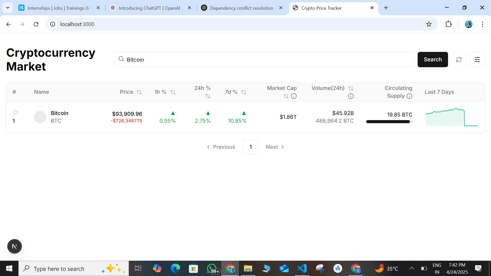
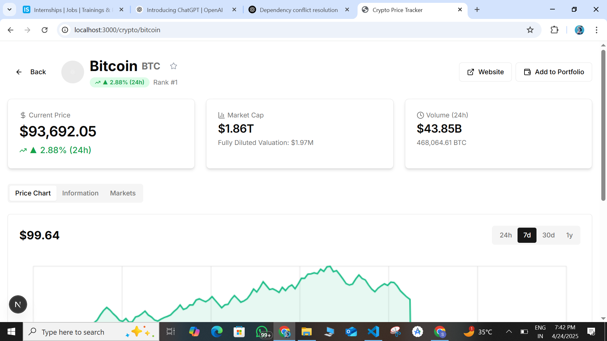
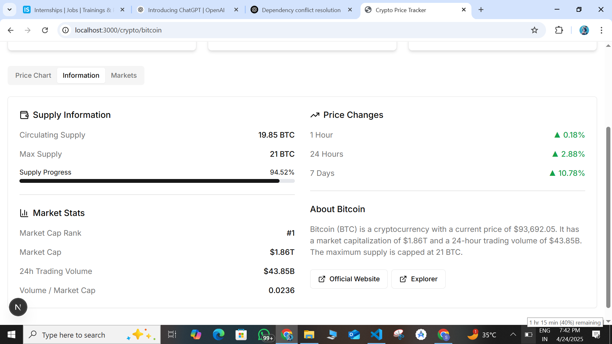
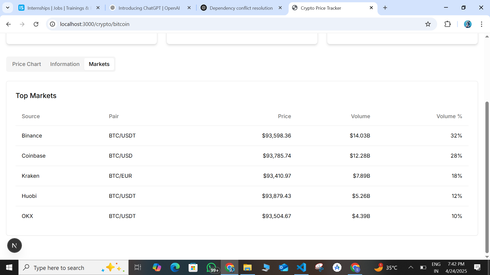

# Real-Time Crypto Price Tracker

A responsive React + Redux Toolkit application that tracks real-time cryptocurrency prices, simulating WebSocket updates and managing all state via Redux.

## 🚀 Demo

Watch the working demo here:  
🔗 [Click to Watch Demo](https://drive.google.com/file/d/1utA95nFlGkVLK9OdaSSR_kL6k_x9ZVM0/view?usp=sharing)

# Website images 

  
  
  
  
  

## Features

### Core Features
- **Responsive UI Table**
  - Displays cryptocurrency data with all required columns
  - Color-coded percentage changes (green for positive, red for negative)
  - Interactive 7-day price charts using canvas
  - Fully responsive design that works on all screen sizes

- **Real-Time Updates**
  - Simulated WebSocket service that updates prices every 1.5 seconds
  - Random fluctuations in price, percentage changes, and volume
  - All updates managed through Redux actions

- **Redux State Management**
  - Complete Redux Toolkit implementation with createSlice
  - Centralized store configuration
  - Selectors for optimized rendering
  - Action creators for state updates

### Bonus Features
- **Search & Filtering**
  - Search by cryptocurrency name or symbol
  - Filter by price range and performance
  - Reset filters functionality

- **Pagination**
  - Paginated results for better performance
  - Customizable items per page

- **Detailed Crypto Views**
  - Individual pages for each cryptocurrency
  - Detailed charts with time period selection
  - Comprehensive information display

- **Favorites System**
  - Star icon to mark favorite cryptocurrencies
  - localStorage persistence between sessions

- **Sorting Functionality**
  - Interactive column headers for sorting data
  - Ascending/descending toggle

- **Visual Enhancements**
  - Tooltips for complex data columns
  - Hover effects on charts
  - Smooth animations and transitions

- **TypeScript**
  - Full TypeScript implementation for type safety

## Tech Stack

- **Frontend Framework**
  - React 18
  - Next.js 14 (App Router)

- **State Management**
  - Redux Toolkit
  - React-Redux

- **Styling**
  - Tailwind CSS
  - shadcn/ui components

- **TypeScript**
  - Type-safe development
  - Interface definitions

- **Chart Rendering**
  - Canvas API for custom charts
  - Interactive data visualization

## Architecture

The application follows a clean architecture pattern:

### Components Layer
- **UI Components**: Reusable UI elements
- **Feature Components**: Specific feature implementations
- **Page Components**: Top-level page layouts

### State Management Layer
- **Redux Store**: Central state management
- **Slices**: Feature-based state management
  - Crypto slice for cryptocurrency data
- **Selectors**: Optimized data access
- **Actions**: State mutations

### Services Layer
- **WebSocket Service**: Simulates real-time data updates
- **Data Service**: Manages data fetching and processing

### Utilities Layer
- **Formatting**: Currency, number, and percentage formatting
- **Helpers**: Reusable utility functions

## Setup Instructions

### Prerequisites
- Node.js 18+ and npm/yarn

### Installation

1. Clone the repository:
   \`\`\`bash
   git clone https://github.com/yourusername/crypto-price-tracker.git
   cd crypto-price-tracker
   \`\`\`

2. Install dependencies:
   \`\`\`bash
   npm install
   # or
   yarn install
   \`\`\`

3. Run the development server:
   \`\`\`bash
   npm run dev
   # or
   yarn dev
   \`\`\`

4. Open [http://localhost:3000](http://localhost:3000) in your browser.

### Building for Production

1. Build the application:
   \`\`\`bash
   npm run build
   # or
   yarn build
   \`\`\`

2. Start the production server:
   \`\`\`bash
   npm start
   # or
   yarn start
   \`\`\`

## Implementation Details

### Real-Time Updates

The application simulates WebSocket connections using a custom `WebSocketService` class that:
- Generates random price fluctuations every 1.5 seconds
- Updates percentage changes and volume data
- Notifies subscribers of data changes
- Manages connection lifecycle
- Allows volatility adjustment

### Redux State Management

All application state is managed through Redux:
- `cryptoSlice`: Manages cryptocurrency data and UI state
- Selectors for optimized component rendering
- Actions for updating crypto data and UI state
- Filter and search functionality

### UI Features

- **Responsive Design**: Works on all device sizes from mobile to desktop
- **Interactive Charts**: Canvas-based charts with hover effects
- **Sorting & Filtering**: Comprehensive data organization options
- **Favorites System**: Bookmark cryptocurrencies with localStorage persistence
- **Pagination**: Efficient data display with pagination controls
- **Detail Views**: In-depth information for each cryptocurrency

## Future Enhancements

- **Real API Integration**: Replace simulation with real cryptocurrency API
- **User Authentication**: Add user accounts and personalized watchlists
- **Portfolio Tracking**: Allow users to track their crypto holdings
- **Price Alerts**: Notify users of significant price movements
- **Historical Data**: Add more comprehensive historical data views
- **Performance Optimization**: Implement virtualized lists for large datasets

## License

MIT
